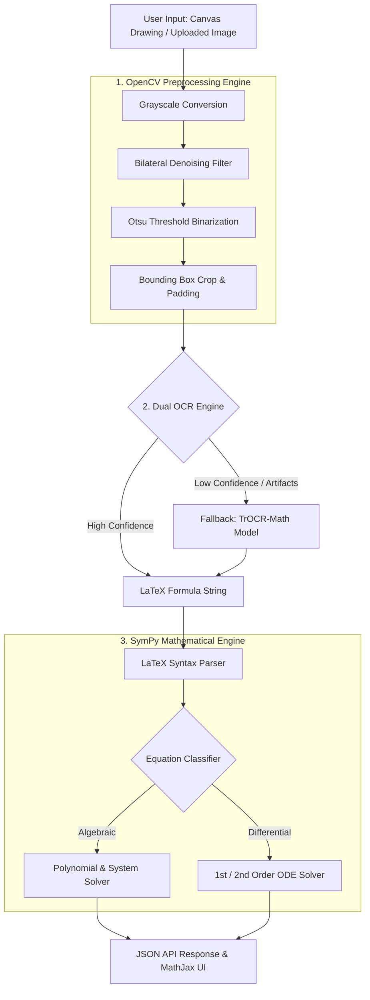

# Equation Slate — Handwritten Math Equation Recognizer & Solver

An end-to-end deep learning web application that recognizes mathematical equations (handwritten drawings or uploaded images), converts them into LaTeX using **Pix2Tex** and **TrOCR-Math**, and solves/simplifies them with **SymPy** — including algebraic equations and differential equations.

[](https://github.com/tarun05-design/Equation-Slate)

     

---

## ⚡ Key Features

- **Dual OCR Engine**: Primary inference via **Pix2Tex (LaTeX-OCR)** with automatic fallback to **TrOCR-Math** (`fhswf/TrOCR_Math_handwritten`) for complex handwritten inputs or low confidence.
- **Advanced Symbolic Solver**: Powered by **SymPy**. Solves linear, quadratic, polynomial, systems of equations, and **1st/2nd order Ordinary Differential Equations (ODEs)**.
- **Interactive Drawing Canvas**: In-browser drawing pad with stroke adjustments, clear options, and direct canvas-to-API transmission.
- **Image Preprocessing Pipeline**: Adaptive grayscale conversion, Bilateral filtering noise reduction, Otsu's threshold binarization, and bounding box cropping.
- **Self-Consistency Confidence Metric**: Multi-sample decoding similarity combined with image quality heuristics (sharpness & ink density).
- **Containerized & Production Ready**: Ready to run via Gunicorn, Docker, or Cloud platforms (Render, Hugging Face Spaces, AWS).

---

## 🏗️ System Architecture & Workflow



---

## 📁 Repository Structure

```tree
mathrecognizer/
├── app.py                       # Flask app entry point & REST API routes
├── config.py                    # Environment-aware configuration (CPU/CUDA, paths, timeouts)
├── run_local.bat                # One-click Windows local development launcher
├── core/
│   ├── preprocessing.py         # OpenCV image processing & binarization pipeline
│   ├── model_inference.py       # Pix2Tex & TrOCR-Math wrappers with auto-fallback
│   └── equation_solver.py       # SymPy LaTeX parser, algebraic & ODE solver
├── utils/
│   └── logger.py                # Logging utility
├── templates/
│   └── index.html               # Single-page web application dashboard
├── static/
│   ├── css/style.css            # UI design tokens, dark mode, glassmorphism
│   └── js/app.js                # Canvas drawing logic, API integrations, LaTeX rendering
├── tests/
│   └── test_differential_solver.py # Unit tests for algebraic and ODE solvers
├── Dockerfile & .dockerignore   # Container configuration
└── requirements.txt             # Python dependencies manifest
```

---

## 🚀 Quick Start (Local Development)

### Prerequisites
- Python **3.10+**

### 1. Clone & Set Up Virtual Environment

```bash
git clone https://github.com/tarun05-design/Equation-Slate.git
cd Equation-Slate/mathrecognizer

# Create virtual environment
python -m venv .venv

# Activate virtual environment
# On Windows:
.venv\Scripts\activate
# On Linux/macOS:
source .venv/bin/activate
```

### 2. Install Dependencies

```bash
pip install -r requirements.txt
```

### 3. Run the Server

#### Option A: One-Click Launcher (Windows)
Double-click [`run_local.bat`](file:///d:/Projects/Maths/equation-slate/mathrecognizer/run_local.bat)

#### Option B: Terminal Command
```bash
python app.py
```

Open your browser to: **`http://localhost:7860`**

---

## 📡 REST API Reference

### `POST /api/recognize`

Recognizes equation from image upload or canvas base64 string and solves it.

**Request Payload (JSON or Multipart Form)**:
```json
{
  "image_data": "data:image/png;base64,iVBORw0KGgoAAAANSUhEUgAA..."
}
```

**Response Payload**:
```json
{
  "request_id": "a1b2c3d4",
  "latex": "2x + 5 = 1",
  "confidence": 0.925,
  "solution": {
    "kind": "equation",
    "solutions": ["-2"],
    "simplified": "2*x + 4",
    "steps": [
      "\\text{Given equation: } 2x + 5 = 1",
      "\\text{Subtract 1 from both sides: } 2x + 4 = 0",
      "x = -2"
    ]
  },
  "solve_warning": null,
  "elapsed_ms": 340
}
```

### `GET /healthz`
Health check endpoint returning container readiness status.

---

## 🐋 Docker Containerization

To build and run locally with Docker:

```bash
# Build Docker image
docker build -t equation-slate .

# Run Docker container
docker run -p 7860:7860 equation-slate
```

Access the application at `http://localhost:7860`.

---

## 📄 License

This project is open-source and available under the [MIT License](LICENSE).
